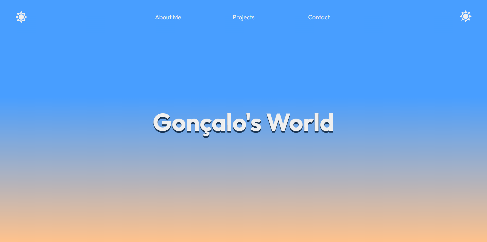
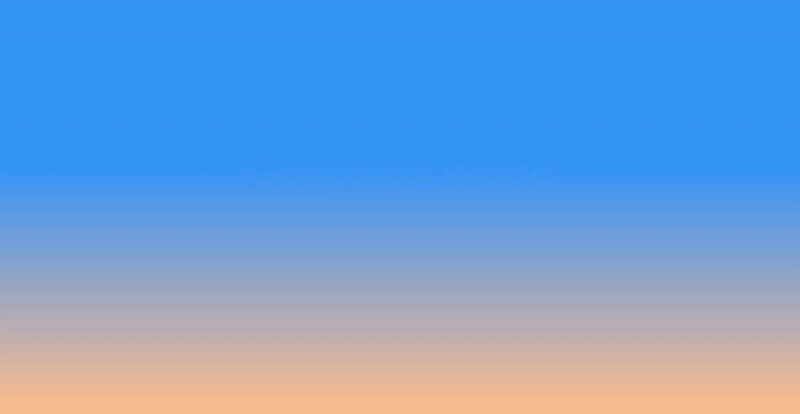

# Goncalo's World

Hey! My name is Gonçalo and I decided to challenge myself, developing a fun, interactive and good looking website!

This website is meant to be used as my personal portfolio. I decided to develop a more compact Single Web Page from scratch. I might change my approach in the future, in case I expand the website.

After studying web technologies and experimenting with several different languages and frameworks, I wanted to take on a project that allowed me to:
- Practice frontend development;
- Experiment with modern tools;
- Build a fully responsive, theme-switching UI with smooth transitions and clean design.

##  Technologies Used

| Technology   | Description                                    |
|--------------|------------------------------------------------|
| **Svelte**   | Reactive JavaScript framework for UI building |
| **TypeScript** | Typed JavaScript for safety and tooling       |
| **Tailwind CSS** | Utility-first CSS for responsive design    |

## Screenshots

<strong>06 / 24 / 2025 : Home Page</strong>

<strong>06 / 24 / 2025 : Home Page (with waves)</strong>
